# Proyecto de Base de Datos: Blockbuster

## Descripción
Blockbuster LLC, conocida como Blockbuster Video, fue una franquicia estadounidense de videoclubes, especializada en alquiler de películas y videojuegos a través de tiendas físicas, servicios por correo y vídeo bajo demanda. Fue una de las precursoras de plataformas como la actual Netflix. Su modelo de negocios se basaba en el alquiler de DVD de juegos y películas.
Sobre el escenario descrito anteriormente, en esta práctica trabajaremos como una base de datos que típicamente se podría encontrar en un establecimiento en el que los clientes están registrados y pueden alquilar películas con un tiempo máximo de alquiler y su histórico de alquileres. Además, se incluyen datos sobre las películas disponibles, los empleados y las tiendas.

## Actividades

Realice las siguientes actividades con la ayuda de psql y el PL/pgSQL:
### 1. Realice la restauración de la base de datos alquilerdvd.tar. Observe que la base de datos no tiene un formato SQL como el empleado en actividades anteriores.
Esta guía explica cómo restaurar una base de datos en PostgreSQL usando un archivo de respaldo en formato `.tar` (por ejemplo, `alquilerdvd.tar`).
#### Pasos a Seguir:
1. Crear una base de datos vacía  
Antes de realizar la restauración, asegúrate de tener una base de datos vacía en la que puedas importar el archivo de respaldo.  
Ejecuta el siguiente comando en la terminal, reemplazando `<nombre_base_datos>` por el nombre de la base de datos que quieres crear (por ejemplo, `alquilerdvd`): `createdb <nombre_base_datos>`
2. Restaurar el Archivo .tar en la Base de Datos
Usa el comando pg_restore para restaurar el archivo .tar en la base de datos creada:  
`pg_restore -d <nombre_base_datos> -U <usuario> -h localhost -p 5432 -c alquilerdvd.tar`  
  -d <nombre_base_datos>: Especifica el nombre de la base de datos de destino.  
  -U <usuario>: Especifica el usuario de PostgreSQL.  
  -h localhost: Indica el host (localhost en este caso).  
  -p 5432: Especifica el puerto, que generalmente es 5432.  
  -c: Elimina los objetos existentes antes de restaurarlos (opcional, si quieres sobrescribir la estructura actual).

### 2. Identifique las tablas, vistas y secuencias.
Para identificar las tablas, vistas y secuencias podemos utilizar diferentes comandos en la consola:
- Para listar las tablas: `\dt`
  
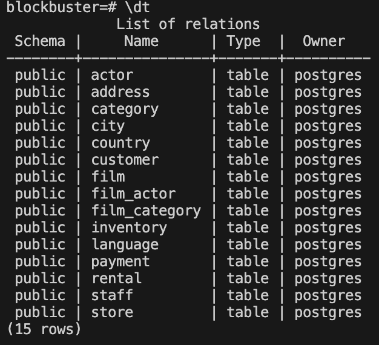

- Para listar vistas: `\dv`:

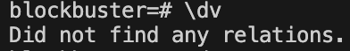

- Para listar secuencias: `\ds`:
  
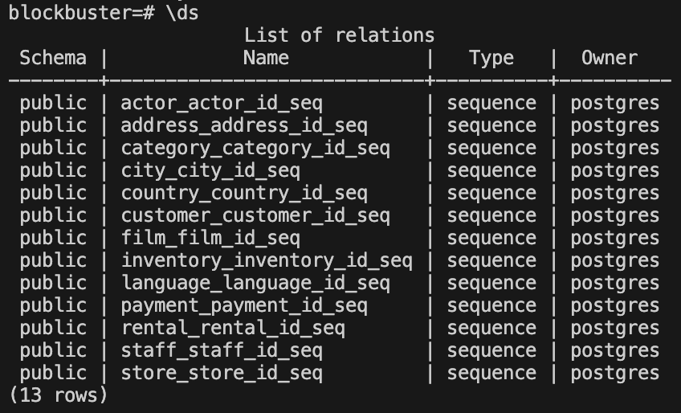

- Para listar todos los objetos: `\d`:

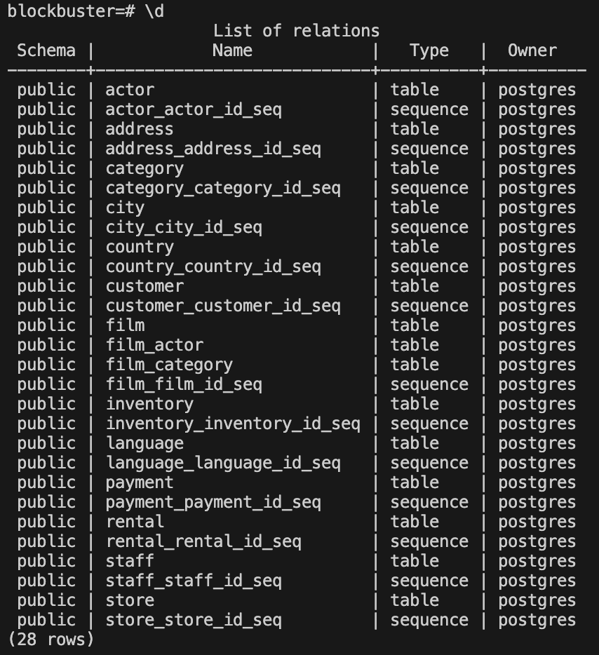  

### 3. Identifique las tablas principales y sus principales elementos.
Listamos y visualizamos los elementos de las tablas más importantes utilizando el comando: `SELECT * FROM [nombre_de_la_tabla]`
Y lo aplicamos a las tablas más importantes como `film`, `rental`, `staff`, `payment` y `customer`.

### 4. Realice las siguientes consultas.
  - #### Obtenga las ventas totales por categoría de películas ordenadas descendentemente.
  Para realizar esta consulta utilizamos el siguiente comando:  

  `
    SELECT 
        c.name AS categoria,
        SUM(p.amount) AS ventas_totales
    FROM 
        payment p
    JOIN 
        rental r ON p.rental_id = r.rental_id
    JOIN 
        inventory i ON r.inventory_id = i.inventory_id
    JOIN 
        film_category fc ON i.film_id = fc.film_id
    JOIN 
        category c ON fc.category_id = c.category_id
    GROUP BY 
        c.name
    ORDER BY 
        ventas_totales DESC;
  `

  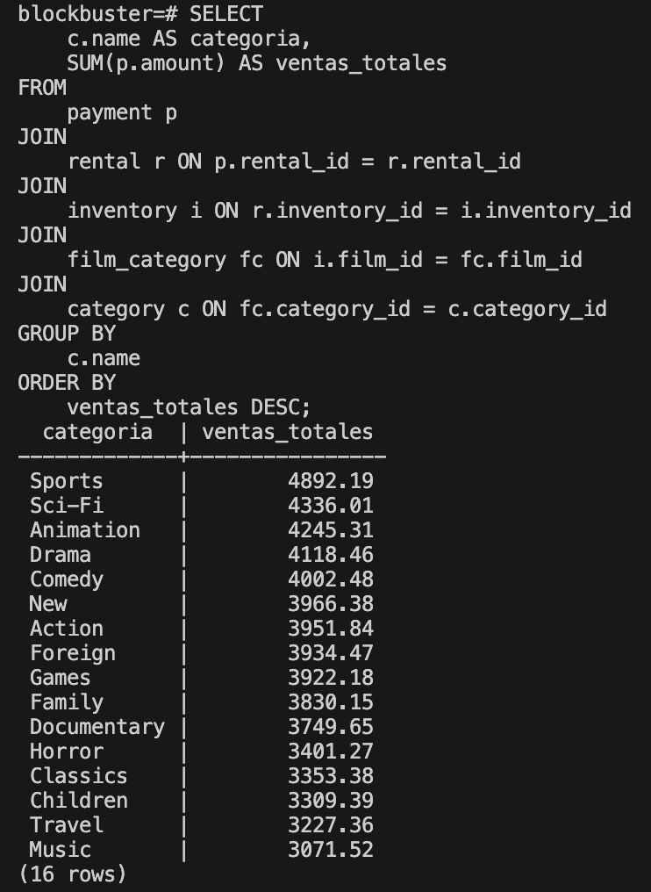  

    Explicación:

    - Objetivo: Obtener el total de ventas (suma de pagos) por cada categoría de película, y ordenar las categorías en orden descendente de ventas.
  
    - Detalles de la consulta:

      payment p: Tabla que almacena los pagos de los clientes.
      
      JOIN rental r: Se une la tabla de pagos con la tabla rental (alquileres) para relacionar cada pago con un alquiler específico.

      JOIN inventory i: Se une con inventory para encontrar el inventario o copia específica de la película que se alquiló.

      JOIN film_category fc: Une el inventario con la categoría de la película mediante la tabla intermedia film_category.

      JOIN category c: Une con category para obtener el nombre de la categoría.

      SUM(p.amount) AS ventas_totales: Suma el total de ventas para cada categoría.

      GROUP BY c.name: Agrupa los resultados por nombre de categoría.

      ORDER BY ventas_totales DESC: Ordena los resultados de mayor a menor.

  - #### Obtenga las ventas totales por tienda, donde se refleje la ciudad, el país (concatenar la ciudad y el país empleando como separador la “,”), y el encargado. Pudiera emplear GROUP BY, ORDER BY
  Para realizar esta consulta utilizamos el siguiente comando:

  `
    SELECT 
        st.store_id AS id_tienda,
        CONCAT(c.city, ', ', co.country) AS ubicacion,
        CONCAT(s.first_name, ' ', s.last_name) AS encargado,
        SUM(p.amount) AS ventas_totales
    FROM 
        payment p
    JOIN 
        rental r ON r.rental_id = p.rental_id
    JOIN 
        staff s ON s.staff_id = r.staff_id
    JOIN 
        store st ON st.manager_staff_id = s.staff_id
    JOIN 
        address a ON a.address_id = st.address_id
    JOIN 
        city c ON c.city_id = a.city_id
    JOIN 
        country co ON co.country_id = c.country_id
    GROUP BY 
        st.store_id, c.city, co.country, s.first_name, s.last_name
    ORDER BY 
        ventas_totales DESC;
  `

  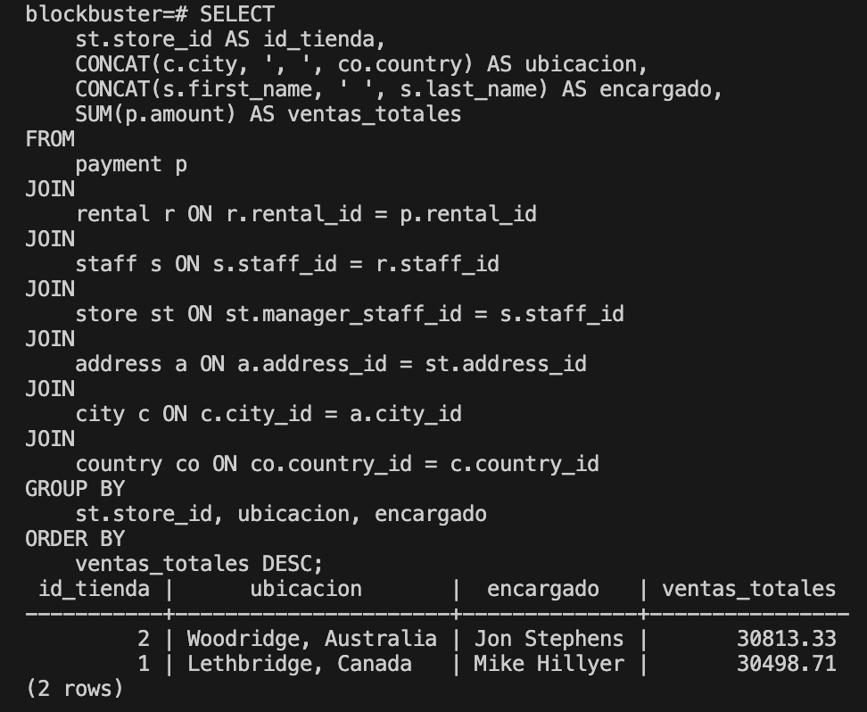 

    Explicación:

    - Objetivo: Mostrar el total de ventas por tienda, junto con la ciudad y país (concatenados como "ciudad, país") y el nombre completo del encargado de la tienda.
  
    - Detalles de la consulta:

      CONCAT(ci.city, ', ', co.country) AS ubicacion: Concatena el nombre de la ciudad y el país separados por una coma para crear la ubicación completa.

      CONCAT(s.first_name, ' ', s.last_name) AS encargado: Concatena el nombre y apellido del encargado de la tienda.
      
      JOIN staff s: Conecta las ventas realizadas con el manager de la tienda.

      JOIN store st: Conecta el manager de la tienda para identificar en qué tienda se vendió.

      JOIN address a, JOIN city ci, y JOIN country co: Estas uniones ayudan a obtener la dirección, ciudad y país de cada tienda.

      SUM(p.amount) AS ventas_totales: Calcula el total de ventas en cada tienda.

      GROUP BY ubicacion, encargado, st.store_id: Agrupa los resultados por ubicación, encargado y tienda.

      ORDER BY ventas_totales DESC: Ordena las ventas de mayor a menor.

  - #### Obtenga una lista de películas, donde se reflejen el identificador, el título, descripción, categoría, el precio, la duración de la película, clasificación, nombre y apellidos de los actores (puede realizar una concatenación de ambos). Pudiera emplear GROUP BY
  Para realizar esta consulta utilizamos el siguiente comando:

  `
    SELECT 
        f.film_id AS id,
        f.title AS titulo,
        c.name AS categoria,
        p.amount AS precio,
        f.length AS duracion,
        f.rating AS clasificacion,
        CONCAT(a.first_name, ' ', a.last_name) AS actor
    FROM 
        film f
    JOIN 
        film_category fc ON fc.film_id = f.film_id
    JOIN 
        category c ON c.category_id = fc.category_id
    JOIN 
        film_actor fa ON fa.film_id = f.film_id
    JOIN 
        actor a ON a.actor_id = fa.actor_id
    JOIN
        inventory i ON i.film_id = f.film_id
    JOIN
        rental r ON r.inventory_id = i.inventory_id
    JOIN
        payment p ON p.rental_id = r.rental_id 
    GROUP BY 
        id, titulo, categoria, precio, duracion, clasificacion, actor
    ORDER BY 
        id;
  `

  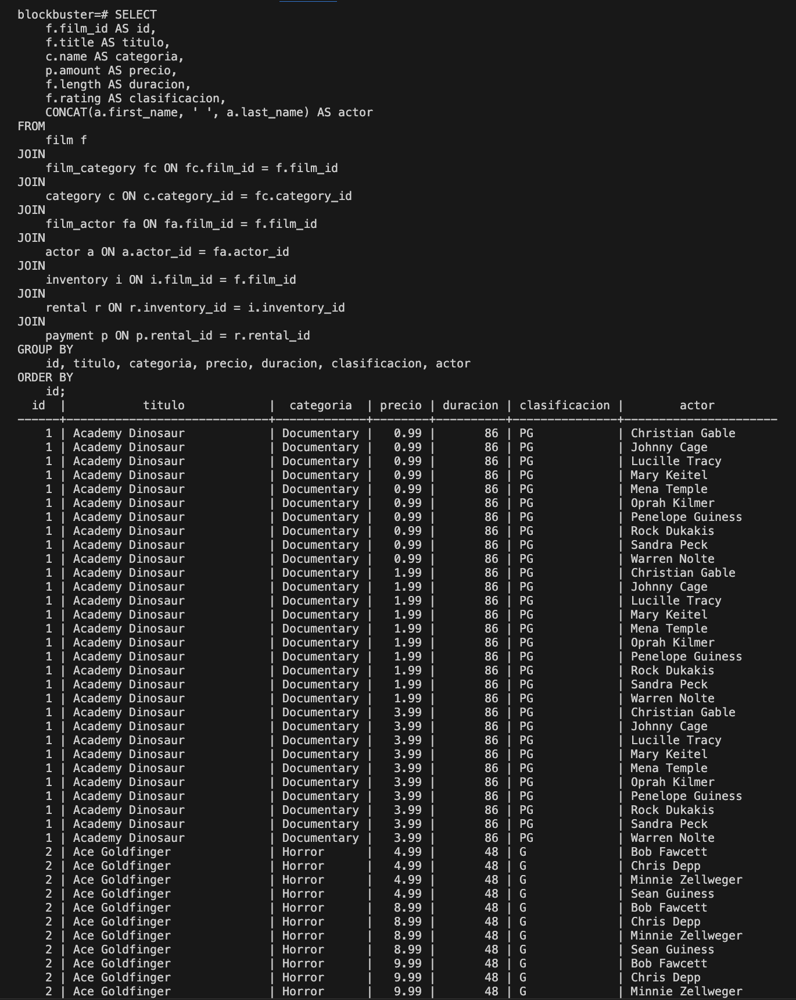 

    Explicación:

    - Objetivo: Listar cada película con detalles completos como categoría, precio, duración, clasificación, y los nombres completos de los actores.

    - Detalles de la consulta:

      CONCAT(a.first_name, ' ', a.last_name) AS actor: Concatena el nombre y apellido de cada actor en una sola columna.

      JOIN film_category y JOIN category: Relaciona la película con su categoría.

      JOIN film_actor y JOIN actor: Relaciona la película con los actores que participan en ella.

      JOIN inventory, JOIN rental y JOIN payment: Relaciona la película con su precio correspondiente.

      GROUP BY y ORDER BY: Agrupa por los elementos de la película (identificador, título, descripción, etc.) y ordena los resultados por el identificador de la película.

  - #### Obtenga la información de los actores, donde se incluya sus nombres y apellidos, las categorías y sus películas. Los actores deben de estar agrupados y, las categorías y las películas deben estar concatenados por “:” 
  Para realizar esta consulta utilizamos el siguiente comando:

  `
    SELECT 
        CONCAT(a.first_name, ' ', a.last_name) AS actor,
        STRING_AGG(CONCAT(c.name, ': ', f.title), ', ') AS categorias_y_peliculas
    FROM 
        actor a
    JOIN 
        film_actor fa ON a.actor_id = fa.actor_id
    JOIN 
        film f ON fa.film_id = f.film_id
    JOIN 
        film_category fc ON f.film_id = fc.film_id
    JOIN 
        category c ON fc.category_id = c.category_id
    GROUP BY 
        actor
    ORDER BY 
        actor;
  `

  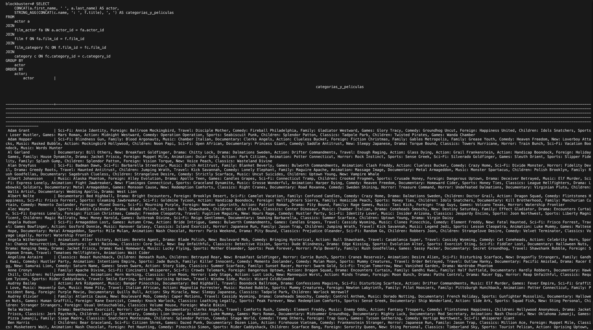 

    Explicación:

    - Objetivo: Listar cada actor junto con las categorías y títulos de las películas en las que participa, con las categorías y películas concatenadas.

    - Detalles de la consulta:
      CONCAT(a.first_name, ' ', a.last_name) AS actor: Concatena el nombre completo del actor.

      STRING_AGG(CONCAT(c.name, ': ', f.title), ', ') AS categorias_y_peliculas: Utiliza STRING_AGG para concatenar la categoría y el título de cada película en una sola cadena para cada actor, separadas por comas.

      JOIN film_actor y JOIN film_category: Relaciona al actor con las películas en las que ha participado y sus respectivas categorías.

      GROUP BY actor: Agrupa los resultados por el nombre completo del actor.

### 5. Realice todas las vistas de las consultas anteriores. Colóqueles el prefijo view_ a su denominación.
Para crear vistas en SQL basadas en las consultas anteriores, podemos usar el comando CREATE VIEW. Esto permitirá que cada consulta tenga una vista asociada, facilitando su reutilización en futuras consultas sin necesidad de escribir la consulta completa nuevamente.  

Aquí muestro cómo crear las vistas para cada una de las consultas anteriores:  

#### 1. Vista para Ventas Totales por Categoría de Películas

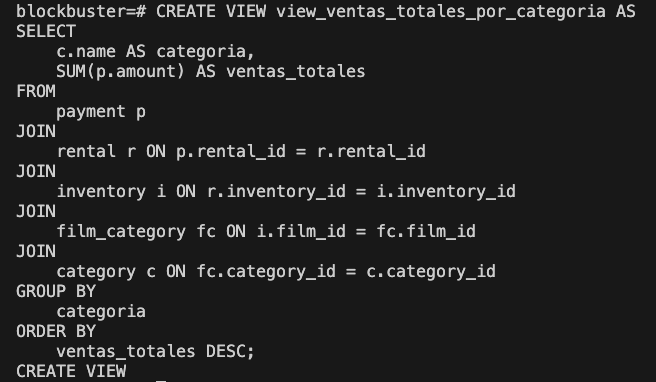 

#### 2. Vista para Ventas Totales por Tienda (con Ciudad, País y Encargado)

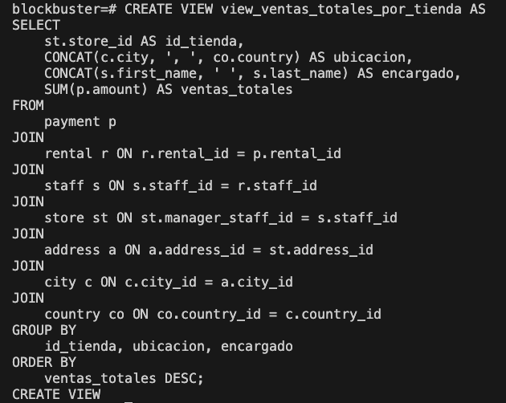 

#### 3. Vista para Lista de Películas con Detalles de Categoría, Precio, Duración, Clasificación y Actores

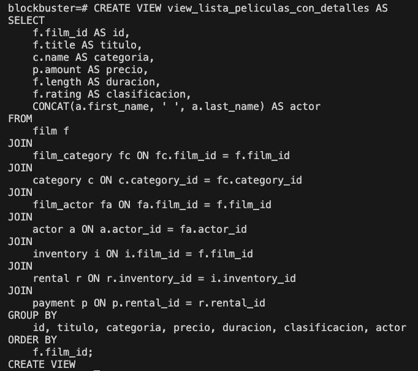 

#### 4. Vista para Información de Actores con sus Categorías y Películas

 

### 6. Haga un análisis del modelo e incluya las restricciones CHECK que considere necesarias.

A continuación, se presentan las tablas principales del modelo y las restricciones CHECK recomendadas:

#### 1. Tabla `Film`
- Descripción: Contiene información sobre las películas, incluyendo título, duración, categoría, calificación, entre otros.

- Restricciones CHECK:  

	Duración (length): La duración debe ser un valor positivo y razonable (por ejemplo, entre 1 y 300 minutos).  
	`CHECK (length > 0 AND length <= 300)`

	Fecha de publicacion (Release_year): El año de publicación no puede ser posterior al actual.  
	`CHECK (release_year <= EXTRACT(YEAR FROM CURRENT_DATE))`

	Valoracion del alquiler (rental_rate): La vaoracion debe ser mayor igual a cero y menor igual que 5.	
	`CHECK (rental_rate >= 0 AND rental_rate <= 5)`

	Duración del alquiler (rental_duration): Establecer un límite de tiempo máximo que puede estar alquilada una pelicula. (ejemplo min 0 max 30 dias)  
	`CHECK (rental_duration >= 0 AND rental_duration <= 30)`

#### 2. Tabla `Payment`
- Descripción: Registra los pagos realizados por los clientes.

- Restricciones CHECK:

	Precio (amount): El precio de pago debe ser positivo.  
	`CHECK (amount > 0)`

	Fecha de pago (payment_date): La fecha de pago debe ser posterior o igual a la fecha del alquiler correspondiente.
	`CHECK (payment_date >= rental_date)`

#### 3. Tabla `Customer`
- Descripción: Contiene información sobre los clientes, como nombre, dirección y estado activo.

- Restricciones CHECK:  
	
	Fecha de creación (create_date): La fecha de creación del cliente no puede ser posterior al actual.  
	`CHECK (create_date <= CURRENT_DATE)`

	Email: Se asegura que el correo electrónico tenga al menos un @.  
	`CHECK (position('@' IN email) > 1)`

#### 4. Tabla `Rental`
- Descripción: Contiene información sobre los alquileres realizados, incluyendo fechas y el inventario alquilado.

- Restricciones CHECK:

	Fecha de devolución (return_date): La fecha de devolución debe ser posterior o igual a la fecha de alquiler.
	`CHECK (return_date >= rental_date)`

	Fecha de alquiler (rental_date): La fecha de alquiler debe ser anterior o igual a la fecha actual.
	`CHECK (rental_date <= CURRENT_DATE)`

#### 5. Tabla `Staff`
- Descripción: Almacena la información sobre el personal, como el nombre, correo electrónico y rol.

- Restricciones CHECK:

	Email: Validación básica para asegurar que el correo electrónico contenga un @.
	`CHECK (position('@' IN email) > 1)`

	Contraseña (password): Restricción de seguridad que comprueba que la contraseña tiene al menos 8 caracteres.
	`CHECK (LENGTH(password) >= 8)`

### 7. Explique la sentencia que aparece en la tabla customer 
    Triggers:  
    last_updated BEFORE UPDATE ON customer  
    FOR EACH ROW EXECUTE PROCEDURE last_updated()  
    Identifique alguna tabla donde se utilice una solución similar.

#### Explicación sentencia trigger en la tabla customer
La sentencia en la tabla customer configura un trigger que actualiza automáticamente la columna last_updated antes de que ocurra cualquier actualización (UPDATE) en la tabla.

- `last_updated`: Este es el nombre del trigger.

- `BEFORE UPDATE`: Indica que el trigger se activará antes de que se ejecute cualquier operación de actualización (UPDATE) en la tabla customer.

- `ON customer`: Especifica que el trigger se aplica a la tabla customer.

- `FOR EACH ROW`: Indica que el trigger se ejecutará una vez por cada fila que se actualice en la tabla.

- `EXECUTE PROCEDURE last_updated()`: Esta parte ejecuta una función llamada `last_updated()`, que probablemente contiene la lógica para actualizar la columna `last_updated` con la fecha y hora actuales.

Este tipo de trigger es común para mantener automáticamente un registro de la última vez que se actualizó cada fila en la tabla.

#### Ejemplo de una Tabla con Solución Similar: `film`
La tabla tiene tres disparadores (`trigger`) configurados, cada uno con un evento específico que los activa y un momento en el que se ejecutan en relación al evento (`BEFORE` o `AFTER`). A continuación, se detalla el propósito y posibles usos de cada uno según la información que has proporcionado:

1. `film_fulltext_trigger`
   - Eventos de Activación: `INSERT`, `UPDATE`

   - Momento de Ejecución: `BEFORE` (antes de la inserción o actualización).

   - Propósito Posible: Este trigger probablemente actualiza un índice de texto completo para la tabla film, lo cual es útil si se utiliza la búsqueda de texto en campos como el título o la descripción. Al ejecutarse antes de la inserción o actualización, puede asegurar que el índice de búsqueda esté actualizado para las búsquedas de texto completo.

2. `last_updated`
   - Evento de Activación: `UPDATE`

   - Momento de Ejecución: `BEFORE`

   - Propósito Posible: Este trigger actualiza automáticamente el campo last_updated cada vez que se realiza una modificación en la tabla film. Esto permite tener un registro preciso de la última fecha y hora de modificación de cada fila, lo cual es útil para auditoría y control de cambios.

### 8. Construya un disparador que guarde en una nueva tabla creada por usted la fecha de cuando se insertó un nuevo registro en la tabla film. 
Para crear un disparador que registre la fecha de inserción de un nuevo registro en la tabla `film`, primero debemos crear una nueva tabla para almacenar la información de las inserciones. Luego, crearemos el disparador (`trigger`) y la función asociada para que el registro se guarde automáticamente cada vez que se inserta una película.

#### Paso 1: Crear la Tabla de Registro de Inserciones
Primero, crearemos una tabla llamada film_insert_log que almacenará el film_id y la fecha de inserción de cada nuevo registro en film.

`CREATE TABLE film_insert_log (
    log_id SERIAL PRIMARY KEY,
    film_id INT NOT NULL,
    insert_date TIMESTAMP DEFAULT CURRENT_TIMESTAMP
);`

- `log_id`: Clave primaria de la tabla `film_insert_log`, se genera automáticamente con `SERIAL`.

- `film_id`: Almacena el identificador de la película que se insertó en la tabla `film`.

- `insert_date`: Almacena la fecha y hora en que se realizó la inserción. Se establece automáticamente con la fecha y hora actuales usando `CURRENT_TIMESTAMP`.

#### Paso 2: Crear la Función para el Trigger
A continuación, crearemos una función llamada log_film_insert() que insertará un registro en film_insert_log cada vez que se ejecute el disparador.

`CREATE OR REPLACE FUNCTION log_film_insert()
RETURNS TRIGGER AS $$
BEGIN
    INSERT INTO film_insert_log (film_id, insert_date)
    VALUES (NEW.film_id, CURRENT_TIMESTAMP);
    RETURN NEW;
END;`

- `NEW.film_id`: Se refiere al `film_id` de la nueva película que se está insertando en la tabla film.
- `CURRENT_TIMESTAMP`: Guarda la fecha y hora de la inserción.

#### Paso 3: Crear el Disparador en la Tabla film
Finalmente, crearemos el disparador que llamará a la función log_film_insert() cada vez que se inserte un nuevo registro en film.

`CREATE TRIGGER film_insert_trigger
AFTER INSERT ON film
FOR EACH ROW
EXECUTE FUNCTION log_film_insert();`

- `AFTER INSERT`: Define que el disparador se activará después de cada inserción en la tabla `film`.
- `FOR EACH ROW`: Se ejecuta una vez por cada fila insertada.

#### Resultado
Cada vez que se inserte un nuevo registro en la tabla `film`, el disparador `film_insert_trigger` ejecutará la función `log_film_insert()`, que insertará un registro en la tabla `film_insert_log` con el `film_id` de la película recién insertada y la fecha y hora de la inserción.

Este mecanismo permite mantener un historial de inserciones en la tabla film y facilita la auditoría o el seguimiento de las películas añadidas.

### 9. Construya un disparador que guarde en una nueva tabla creada por usted la fecha de cuando se eliminó un registro en la tabla film y el identificador del film. 
Para crear un disparador que registre la fecha y el identificador de cada película eliminada de la tabla `film`, vamos a seguir un proceso similar al anterior. Primero, crearemos una nueva tabla para almacenar esta información. Luego, definiremos la función del disparador y finalmente el propio disparador para que se ejecute cada vez que se elimine un registro en `film`.

#### Paso 1: Crear la Tabla de Registro de Eliminaciones
Primero, creamos una tabla llamada `film_delete_log` para almacenar el `film_id` y la fecha de eliminación de cada registro eliminado en `film`.

`CREATE TABLE film_delete_log (
    log_id SERIAL PRIMARY KEY,
    film_id INT NOT NULL,
    delete_date TIMESTAMP DEFAULT CURRENT_TIMESTAMP
);`

- `log_id`: Clave primaria de la tabla `film_delete_log`, que se genera automáticamente.

- `film_id`: Almacena el identificador de la película que se eliminó de la tabla `film`.

- `delete_date`: Almacena la fecha y hora en que se eliminó el registro, establecida automáticamente con la fecha y hora actuales usando `CURRENT_TIMESTAMP`.

#### Paso 2: Crear la Función para el Trigger
A continuación, creamos una función llamada `log_film_delete()` que insertará un registro en `film_delete_log` cada vez que se ejecute el disparador al eliminar una película.

`CREATE OR REPLACE FUNCTION log_film_delete()
RETURNS TRIGGER AS $$
BEGIN
    INSERT INTO film_delete_log (film_id, delete_date)
    VALUES (OLD.film_id, CURRENT_TIMESTAMP);
    RETURN OLD;
END;`

- `OLD.film_id`: Utiliza el valor de `film_id` de la fila que está a punto de ser eliminada en la tabla `film`.
- `CURRENT_TIMESTAMP`: Guarda la fecha y hora en que se ejecuta el disparador, es decir, cuando ocurre la eliminación.

#### Paso 3: Crear el Disparador en la Tabla `film`
Finalmente, creamos el disparador que llamará a la función `log_film_delete()` cada vez que se elimine un registro en `film`.

`CREATE TRIGGER film_delete_trigger
AFTER DELETE ON film
FOR EACH ROW
EXECUTE FUNCTION log_film_delete();`

- `AFTER DELETE`: Define que el disparador se activará después de cada eliminación en la tabla `film`.
- `FOR EACH ROW`: Se ejecuta una vez por cada fila eliminada.

#### Resultado
Cada vez que se elimine un registro en la tabla `film`, el disparador `film_delete_trigger` ejecutará la función `log_film_delete()`, que insertará un registro en la tabla `film_delete_log` con el `film_id` de la película eliminada y la fecha y hora de eliminación.

Esta solución proporciona un registro histórico de las películas eliminadas, incluyendo su identificador y el momento en que se eliminaron.

### 10. Comente el significado y la relevancia de las secuencias.
Las secuencias en bases de datos son objetos que generan valores numéricos secuenciales de manera automática. Son comúnmente utilizadas para crear valores únicos en una columna, especialmente en claves primarias o identificadores de registros, evitando así duplicados y permitiendo que cada fila tenga un identificador distinto y consistente.

#### Significado de las Secuencias
1. Generación Automática de Identificadores Únicos:
   - Una secuencia crea un número nuevo cada vez que se le solicita, generando así un valor incremental que es útil para campos de clave primaria.

   - Las secuencias aseguran que cada valor generado es único, lo cual es esencial para mantener la integridad de los datos.

2. Control de Incrementos:
   - Las secuencias permiten definir el valor inicial, el incremento, el valor máximo y otros parámetros. Esto facilita la personalización y control sobre cómo se generan los valores.

   - Por ejemplo, una secuencia puede comenzar en 1000 y aumentar en 10 con cada nuevo valor (1000, 1010, 1020), adaptándose a las necesidades del sistema.

3. Independencia de los Datos:
   - Las secuencias funcionan de manera independiente a los datos de la tabla. No están afectadas por inserciones, eliminaciones o cambios en la tabla.

   - Esto es útil en situaciones donde múltiples usuarios insertan datos simultáneamente, asegurando que cada nuevo registro recibe un identificador único.

#### Relevancia de las Secuencias en Bases de Datos
1. Eficiencia en la Gestión de Claves Primarias:
   - Usar secuencias es una práctica común para gestionar claves primarias automáticas. Es especialmente relevante en sistemas de gran escala donde se requieren identificadores únicos y rápidos.

   - Los sistemas de bases de datos usan secuencias para gestionar el tipo de datos SERIAL en PostgreSQL o AUTO_INCREMENT en MySQL, lo que simplifica la inserción de nuevos datos.

2. Integridad y Consistencia de los Datos:
   - La generación de identificadores únicos y consecutivos ayuda a mantener la consistencia, evitando duplicados y errores de referencia entre tablas relacionadas.
   - En sistemas donde las tablas están relacionadas, el uso de secuencias garantiza que las referencias a registros específicos sean confiables.
#### Optimización en la Concurrencia de Inserciones:
- Las secuencias son especialmente relevantes en sistemas donde múltiples usuarios realizan inserciones al mismo tiempo. Las secuencias generan identificadores sin bloquear la tabla, permitiendo un alto rendimiento y evitando cuellos de botella en la base de datos.

#### Ejemplo de Uso de una Secuencia en PostgreSQL

En PostgreSQL, podríamos crear una secuencia llamada user_id_seq y utilizarla para asignar valores a la columna user_id de una tabla users:  
`CREATE SEQUENCE user_id_seq
    START WITH 1
    INCREMENT BY 1
    NO MINVALUE
    NO MAXVALUE
    CACHE 1;`

Luego, podemos usar la secuencia en una tabla:  
`CREATE TABLE users (
    user_id INT DEFAULT nextval('user_id_seq'),
    username VARCHAR(50) NOT NULL,
    email VARCHAR(100) NOT NULL
);`

Con esta configuración:
Cada vez que se inserte un nuevo registro en users, el user_id se rellenará automáticamente con el siguiente valor de user_id_seq, garantizando que cada usuario tenga un identificador único.