# Índice
- [Índice](#índice)
- [Enunciado](#enunciado)
- [Entrega](#entrega)
  - [1. Descripción de cada una de las entidades.](#1-descripción-de-cada-una-de-las-entidades)
    - [**Empresa**](#empresa)
    - [**Vivero**](#vivero)
    - [**Zona**](#zona)
    - [**Empleado**](#empleado)
    - [**Producto**](#producto)
    - [**Pedido**](#pedido)
    - [**Cliente**](#cliente)
    - [**Cliente+**](#cliente-1)
  - [2. Descripción y ejemplos ilustrativos del dominio de cada uno de los atributos de las entidades y de las relaciones.](#2-descripción-y-ejemplos-ilustrativos-del-dominio-de-cada-uno-de-los-atributos-de-las-entidades-y-de-las-relaciones)
    - [**Empresa**](#empresa-1)
    - [**Vivero**](#vivero-1)
    - [**Zona**](#zona-1)
    - [**Empleado**](#empleado-1)
    - [**Producto**](#producto-1)
    - [**Pedido**](#pedido-1)
    - [**Cliente**](#cliente-2)
    - [**Cliente+**](#cliente-3)
  - [3. Descripción de cada una de las relaciones definidas.](#3-descripción-de-cada-una-de-las-relaciones-definidas)
    - [**Vivero-Empresa**](#vivero-empresa)
    - [Relación: Tiene](#relación-tiene)
    - [**Vivero-Zona**](#vivero-zona)
    - [Relación: Pertenece](#relación-pertenece)
    - [**Empleado-Zona**](#empleado-zona)
    - [Relación: Trabaja](#relación-trabaja)
    - [**Producto-Zona**](#producto-zona)
    - [Relación: Asignado](#relación-asignado)
    - [**Empleado-Pedido**](#empleado-pedido)
    - [Relación: Realiza](#relación-realiza)
    - [**Pedido-Producto**](#pedido-producto)
    - [Relación: Tiene](#relación-tiene-1)
    - [**Pedido-Cliente**](#pedido-cliente)
    - [Relación: Realiza](#relación-realiza-1)
  - [4. Restricciones semánticas](#4-restricciones-semánticas)
    - [Restricciones semánticas en el modelo entidad-relación](#restricciones-semánticas-en-el-modelo-entidad-relación)
      - [1. Relaciones](#1-relaciones)
      - [2. Entidades y atributos identificadores](#2-entidades-y-atributos-identificadores)
      - [3. Condiciones sobre los atributos](#3-condiciones-sobre-los-atributos)

# Enunciado 
La empresa Tajinaste S.A. se dedica a la venta de plantas, productos de jardinería y decoración a través de su red de viveros. En la actualidad, la empresa está interesada en llevar un control del stock en los viveros.

En cada vivero los productos se asignan a zonas. Por ejemplo, zona exterior, almacén, etc. De cada vivero y cada una de las zonas del vivero se conoce su georreferenciación (latitud y longitud). Se quiere saber de cada producto cuánto hay disponible en cada zona en las que esté asignado

Del mismo modo se quiere llevar un control de los empleados, que pueden ser destinados a diferentes viveros según la época del año, pero nunca van a tener dos destinos. En cada vivero que desempeñe una tarea lo hará en una zona, se quiere llevar el control de la productividad de cada zona a lo largo del tiempo, y de cada empleado. Por esta razón es necesario hacer un seguimiento del histórico del puesto en el que trabajan los empleados.

En Tajinaste S.A. también se aplica un programa de fidelización, de forma que a un cliente que pertenezca al programa Tajinaste Plus se le asignan bonificaciones en función del volumen de compras que ha realizado mensualmente. De cara a realizar campañas entre los clientes Tajinaste Plus se controlan los pedidos que estos han realizado desde su ingreso en el programa. Otro de los factores a considerar en la productividad es la capacidad de los empleados de lograr objetivos de venta, por lo que se lleva el control de los pedidos que gestiona un empleado a los clientes Tajinaste Plus, teniendo en cuenta que cada pedido sólo tiene un responsable.
de pago de las compras que realizan.

# Entrega

## 1. Descripción de cada una de las entidades.
### **Empresa**
Representa la compañía Tajinaste S.A., que gestiona los viveros.

### **Vivero**
Representa cada uno de los establecimientos de la empresa donde se almacenan y venden los productos de jardinería y decoración.
Se identifica mediante su georreferenciación, en la que incluye la latitud y la longitud.

### **Zona**
Cada vivero está dividido en zonas, como almacenes, áreas exteriores, etc., donde se asignan productos y donde trabajan los empleados.
Se identifica mediante su georreferenciación, en la que incluye la latitud y la longitud.

### **Empleado**
Los trabajadores de la empresa que desempeñan tareas específicas en los viveros y zonas asignadas.
Se identifica mediante su ID de empleado.
Tienen un nombre y una serie de objetivos cumplidos, que determinan su productividad.

### **Producto**
Representa los artículos que vende la empresa, como plantas, productos de jardinería y decoración.
Se identifica mediante su ID, que garantiza que no exista otro producto con su mismo identificador.
Se almacena el nombre del producto y el stock del mismo.

### **Pedido**
Representa las órdenes de compra que se generan cuando un cliente adquiere productos.
Se identifica mediante su ID para poder localizar un pedido en concreto.
Se almacena la fecha en la que se realizó el pedido.

### **Cliente**
Personas o entidades que realizan compras en los viveros de la empresa.
Se identifican mediante su ID de cliente.

### **Cliente+**
Subtipo de cliente que pertenece al programa de fidelización Tajinaste Plus. Tienen beneficios como bonificaciones basadas en el volumen de compras.
Se identifican mediante su ID de cliente.
Se registra la fecha en la que accedió al programa de bonificaciones, el número de compras que ha realizado y el porcentaje de descuento que se le aplica.

## 2. Descripción y ejemplos ilustrativos del dominio de cada uno de los atributos de las entidades y de las relaciones.
### **Empresa**

  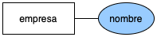

  - `(PK)` Nombre empresa: `string`
    - Puede tomar cualquier valor de tipo `string` que represente el nombre de la empresa. Ejemplo: "Tajinaste S.A."

### **Vivero**

  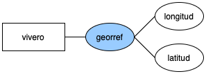

  - `(PK)` Georreferenciación: `float`
  - Es un atributo compuesto por otros dos atributos:
    - Latitud: `float`
      - Puede tomar cualquier valor de tipo `float` que represente la latitud en el eje de coordenadas. Ejemplo: "123456.78"
    - Longitud: `float`
      - Puede tomar cualquier valor de tipo `float` que represente la longitud en el eje de coordenadas. Ejemplo: "876543.21"

### **Zona**

  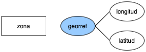

  - `(PK)` Georreferenciación: `float`
  - Es un atributo compuesto por otros dos atributos:
    - Latitud: `float`
      - Puede tomar cualquier valor de tipo `float` que represente la latitud en el eje de coordenadas. Ejemplo: "123456.78"
    - Longitud: `float`
      - Puede tomar cualquier valor de tipo `float` que represente la longitud en el eje de coordenadas. Ejemplo: "876543.21"

### **Empleado**

  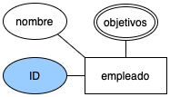

  - `(PK)` ID empleado: `int`
    - Puede tomar cualquier valor de tipo `int` que represente el ID del empleado. Ejemplo: "123456"

  - Nombre del empleado: `string`
    - Puede tomar cualquier valor de tipo `string` que represente el nombre del empleado. Ejemplo: "Marcos"

  - Objetivos: `string`
    - Es un atributo multievaluado, por lo que puede tomar varios valores
    - Puede tomar cualquier valor de tipo `string` que describa el objetivo que dicho empleado ha realizado. Ejemplo: "Vender diez productos"

### **Producto**

  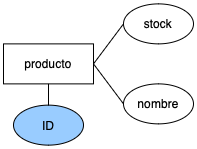

  - `(PK)` ID producto: `int`
    - Puede tomar cualquier valor de tipo `int` que represente el ID del producto. Ejemplo: "123456"

  - Nombre del producto: `string`
    - Puede tomar cualquier valor de tipo `string` que represente el nombre del producto. Ejemplo: "Margarita"

  - Stock: `int`
    - Puede tomar cualquier valor de tipo `int` que represente las unidades en stock del producto. Ejemplo: "100" 

### **Pedido**

  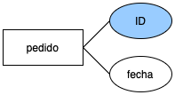

  - `(PK)` ID pedido: `int`
    - Puede tomar cualquier valor de tipo `int` que represente el ID del pedido. Ejemplo: "123456"
  
  - Fecha realización: `fecha`
    - Puede tomar cualquier valor de tipo `fecha` que represente la fecha en la que se realizó el pedido. Ejemplo: "2024-10-01"

### **Cliente**

  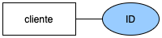

  - `(PK)` ID cliente: `int`
    - Puede tomar cualquier valor de tipo `int` que represente el ID del cliente. Ejemplo: "123456"

### **Cliente+**

  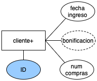

  - `(PK)` ID cliente+: `int`
    - Puede tomar cualquier valor de tipo `int` que represente el ID del cliente que pertenece a Tajinaste Plus. Ejemplo: "123456"
  
  - Fecha ingreso: `fecha`
    - Puede tomar cualquier valor de tipo `fecha` que represente la fecha en la que el cliente ingresó en la membresía. Ejemplo: "2024-10-01"
  
  - Bonificación: `int`
    - Puede tomar cualquier valor de tipo `int` que represente el porcentaje de descuento que se le realiza al cliente por pertenecer a la membresía. Ejemplo: "30"
  
  - Número de compras: `int`
    - Puede tomar cualquier valor de tipo `int` que represente el número de compras que ha realizado el cliente desde que pertenece a la membresía. Ejemplo: "5"

## 3. Descripción de cada una de las relaciones definidas.
### **Vivero-Empresa**

  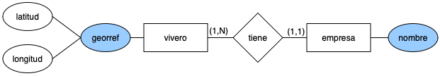

  ### Relación: Tiene
  Muestra la relación entre la empresa y los viveros que tiene. 

  La cardinalidad de la relación es:

  - **(1, N)** para la empresa, una empresa tiene 1 o muchos viveros.
  - **(1, 1)** para el vivero, un vivero sólo puede pertenecer a una empresa.

### **Vivero-Zona**

  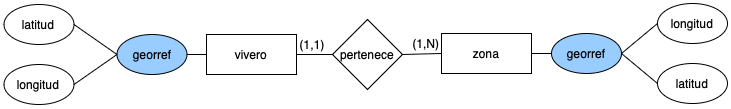

  ### Relación: Pertenece
  Muestra la relación entre una zona y el vivero al que pertenece.

  La cardinalidad de la relación es:

  - **(1, 1)** para la zona, una zona pertenece a un sólo vivero.
  - **(1, N)** para el vivero, ya que un mismo vivero puede tener una o múltiples zonas.

### **Empleado-Zona**

  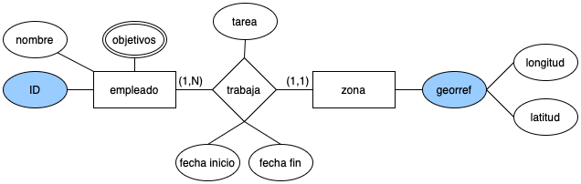

  ### Relación: Trabaja
  Muestra la relación entre un empleado y la zona en la que trabaja.

  La cardinalidad de la relación es:

  - **(1, N)** para la zona, ya que en una zona pueden trabajar de uno a muchos empleados.
  - **(1, 1)** para el empleado, ya que un empleado sólo puede trabajar en una zona a la vez.
  - Se le han asignado los atributos **tarea**, **fecha inicio** y **fecha fin** para llevar el control de la productividad en una cierta tarea.

### **Producto-Zona**

  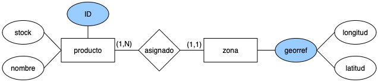

  ### Relación: Asignado
  Muestra la relación entre un producto y la zona a la que ha sido asignado.

  La cardinalidad de la relación es:

  - **(1, N)** para la zona, una zona puede tener asignados uno o muchos productos.
  - **(1, 1)** para el producto, ya que un producto sólo puede ser asignado a una zona.

### **Empleado-Pedido**

  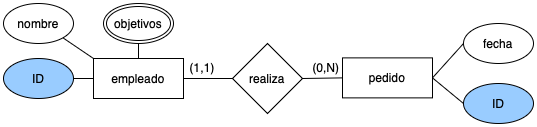

  ### Relación: Realiza
  Muestra la relación entre un empleado y el pedido que realiza.

  La cardinalidad de la relación es:

  - **(1, 1)** para el pedido, un pedido sólo puede ser realizado por un empleado.
  - **(0, N)** para el empleado, un empleado puede realizar cero o más pedidos.

### **Pedido-Producto**

  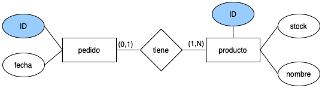

  ### Relación: Tiene
  Muestra la relación entre un pedido y los productos que tiene.

  La cardinalidad de la relación es:

  - **(0, 1)** para el producto, un producto puede tener o no un pedido asociado.
  - **(1, N)** para el pedido, un pedido tiene mínimo un producto y máximo N productos asociados.

### **Pedido-Cliente**

  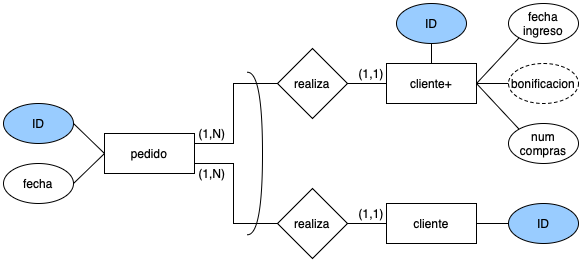

  En esta relación se muestra una restricción de exclusividad, la cual indica en este caso que un pedido puede estar relacionado con un cliente normal o bien con un cliente+ miembro de la membresía Tajinaste Plus, pero no puede estar relacionado con ambos a la vez.

  ### Relación: Realiza
  Muestra la relación entre un cliente y el pedido que realiza.

  La cardinalidad de la relación es:

  - **(1, N)** para el cliente, un cliente realiza uno o más pedidos, ya que si no tuviese ningún pedido realizado no se identificaría como cliente.
  - **(1, 1)** para el pedido, un pedido sólo puede ser realizado por un cliente.

## 4. Restricciones semánticas

### Restricciones semánticas en el modelo entidad-relación

#### 1. Relaciones
- **Dependencia de existencia**:
- Varias relaciones en el modelo implican que una entidad no puede existir sin estar vinculada a otra entidad. Por ejemplo, la relación "realiza" entre *Pedido* y *Cliente* sugiere que un cliente debe estar asociado con un pedido y viceversa ya que no puede existir un pedido que no pertenezca a ningun cliente y tampoco puede existir un cliente sin que tenga algún pedido asociado.
  
- **Integridad referencial**: Para las relaciones como "tiene", entre las entidades *Pedido* y *Producto* se asegura que los pedidos solo interactúan con productos existentes, lo que implica una validación de la integridad de las relaciones al momento de realizar operaciones.

- **Unicidad en las asociaciones**: Algunas relaciones, como "realiza", imponen restricciones de exclusividad, donde un pedido sólo puede estar asociado a un único empleado, lo que garantiza la integridad en el origen de los pedidos.

#### 2. Entidades y atributos identificadores
- **Atributos identificadores únicos**: Todas las entidades cuentan con identificadores únicos (como *ID*, *georref*, o *Nombre*) que aseguran la unicidad y la integridad dentro del sistema. Estos atributos son cruciales para evitar duplicidades y garantizar la correcta identificación de cada instancia en las bases de datos.

- **Restricciones de integridad de los datos**: Atributos como el stock del producto, las fechas, y las georreferenciaciones están sujetos a restricciones de integridad, lo que asegura que se introduzcan datos válidos y consistentes dentro del modelo.

#### 3. Condiciones sobre los atributos
- **Validaciones temporales**: Atributos como la *Fecha inicio* y *Fecha fin* en la relación del empleado asignado a una zona sugieren la existencia de restricciones que aseguran que las fechas tengan coherencia lógica (por ejemplo, la fecha de inicio debe ser anterior a la fecha de fin).

- **Integridad sobre valores**: Otros atributos como la bonificación o el stock pueden estar sujetos a restricciones adicionales de negocio, como límites en el descuento proporcionado de la bonificación, ya que este no puede superar ciertos límites en los que dejaría de ser rentable la realización del pedido. O restricciones en las cantidades mínimas o máximas que se pueden vender, las cuales deben ser respetadas para mantener la coherencia de las operaciones.

Este conjunto de restricciones semánticas mejora la interpretación del modelo y asegura que los datos ingresados cumplan con las reglas del negocio y las relaciones reales entre las entidades.

