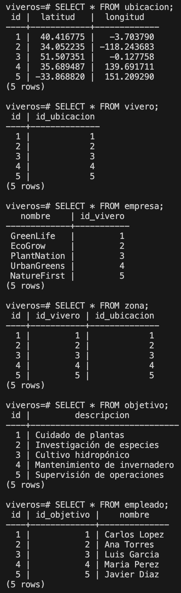
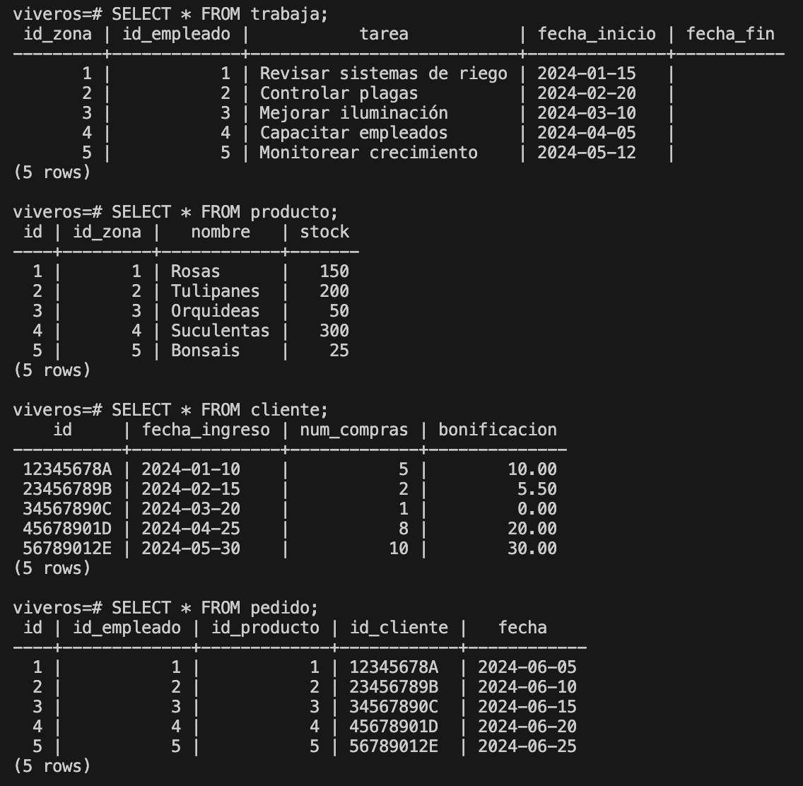
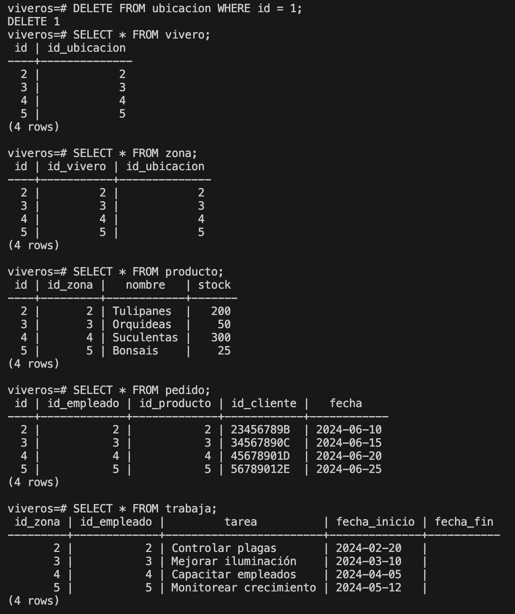
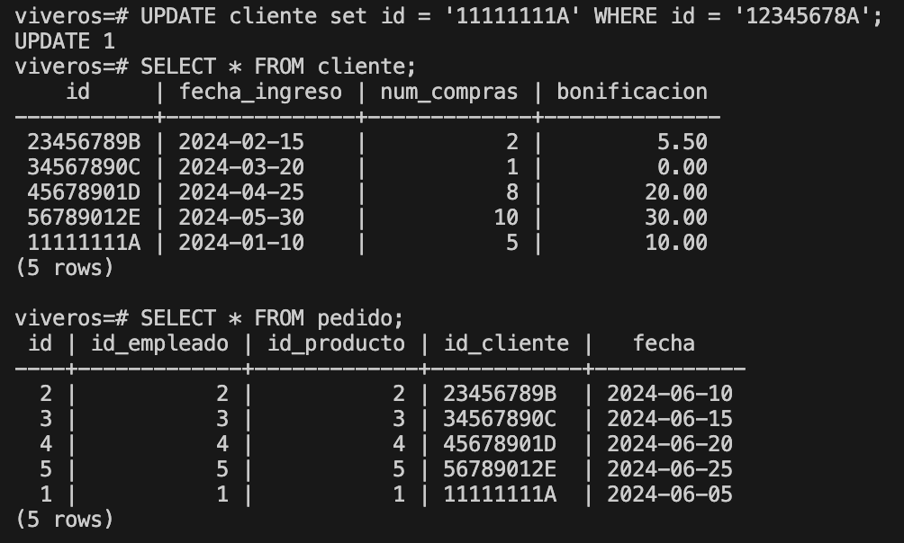
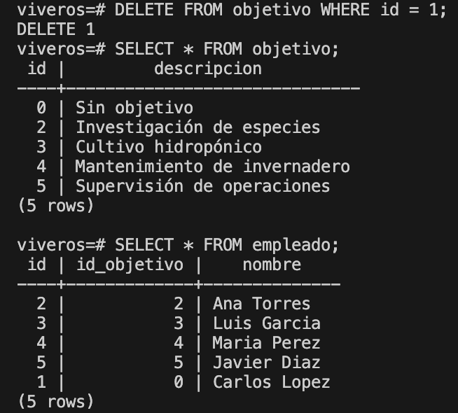
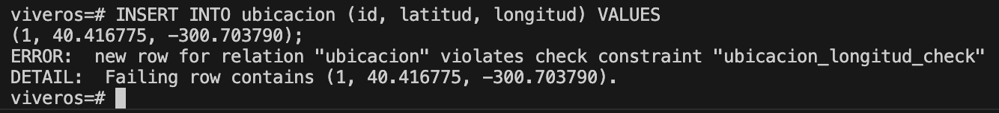
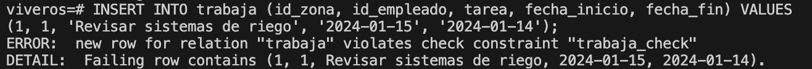
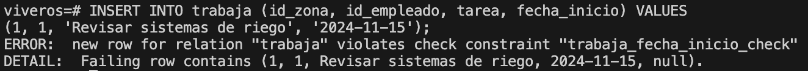
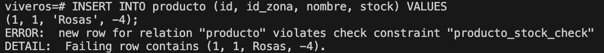
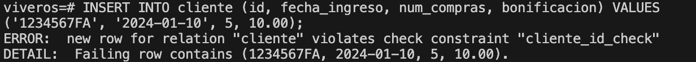

# Proyecto de Base de Datos: Viveros

Este proyecto define la estructura de una base de datos para gestionar la información relacionada con viveros, empleados, productos y operaciones asociadas a una empresa de viveros. La base de datos incluye diversas tablas interrelacionadas que se detallan a continuación junto con las restricciones de integridad referencial aplicadas.

## Estructura de la Base de Datos

### Tablas y Descripción

#### Modelo Relacional

- **UBICACION** (`ID`, `latitud`, `longitud`)

- **VIVERO** (`ID`, `id_ubicacion`)
  - `id_ubicacion`: **FOREIGN KEY** `UBICACION` (`ID`)

- **EMPRESA** (`NOMBRE`, `id_vivero`)
  - `id_vivero`: **FOREIGN KEY** `VIVERO` (`ID`)

- **ZONA** (`ID`, `ID_VIVERO`, `id_ubicacion`)
  - `id_vivero`: **FOREIGN KEY** `VIVERO` (`ID`)
  - `id_ubicacion`: **FOREIGN KEY** `UBICACION` (`ID`)

- **OBJETIVO** (`ID`, `descripcion`)

- **EMPLEADO** (`ID`, `id_objetivo`, `nombre`)
  - `id_objetivo`: **FOREIGN KEY** `OBJETIVO` (`ID`)

- **TRABAJA** (`ID_ZONA`, `ID_EMPLEADO`, `tarea`, `fecha_inicio`, `fecha_fin`)
  - `ID_ZONA`: **FOREIGN KEY** `ZONA` (`ID`)
  - `ID_EMPLEADO`: **FOREIGN KEY** `EMPLEADO` (`ID`)

- **PRODUCTO** (`ID`, `id_zona`, `nombre`, `stock`)
  - `id_zona`: **FOREIGN KEY** `ZONA` (`ID`)

- **CLIENTE** (`ID`, `fecha_ingreso`, `num_compras`, `bonificacion`)

- **PEDIDO** (`ID`, `id_empleado`, `id_producto`, `id_cliente`, `fecha`)
  - `id_empleado`: **FOREIGN KEY** `EMPLEADO` (`ID`)
  - `id_producto`: **FOREIGN KEY** `PRODUCTO` (`ID`)
  - `id_cliente`: **FOREIGN KEY** `CLIENTE` (`ID`)

- **UBICACION** (`ID`, `latitud`, `longitud`)

- **VIVERO** (`ID`, `id_ubicacion`)
  - `id_ubicacion`: **FOREIGN KEY** `UBICACION` (`ID`)

- **EMPRESA** (`NOMBRE`, `id_vivero`)
  - `id_vivero`: **FOREIGN KEY** `VIVERO` (`ID`)

- **ZONA** (`ID`, `ID_VIVERO`, `id_ubicacion`)
  - `id_vivero`: **FOREIGN KEY** `VIVERO` (`ID`)
  - `id_ubicacion`: **FOREIGN KEY** `UBICACION` (`ID`)

- **OBJETIVO** (`ID`, `descripcion`)

- **EMPLEADO** (`ID`, `id_objetivo`, `nombre`)
  - `id_objetivo`: **FOREIGN KEY** `OBJETIVO` (`ID`)

- **TRABAJA** (`ID_ZONA`, `ID_EMPLEADO`, `tarea`, `fecha_inicio`, `fecha_fin`)
  - `ID_ZONA`: **FOREIGN KEY** `ZONA` (`ID`)
  - `ID_EMPLEADO`: **FOREIGN KEY** `EMPLEADO` (`ID`)

- **PRODUCTO** (`ID`, `id_zona`, `nombre`, `stock`)
  - `id_zona`: **FOREIGN KEY** `ZONA` (`ID`)

- **CLIENTE** (`ID`, `fecha_ingreso`, `num_compras`, `bonificacion`)

- **PEDIDO** (`ID`, `id_empleado`, `id_producto`, `id_cliente`, `fecha`)
  - `id_empleado`: **FOREIGN KEY** `EMPLEADO` (`ID`)
  - `id_producto`: **FOREIGN KEY** `PRODUCTO` (`ID`)
  - `id_cliente`: **FOREIGN KEY** `CLIENTE` (`ID`)

#### Descripción de los atributos y restricciones

1. **`ubicacion`**:
   - Contiene la latitud y longitud de ubicaciones específicas.
   - **Clave primaria**: `id`.

2. **`vivero`**:
   - Representa los viveros con un identificador y una ubicación asociada.
   - **Claves**: `id` (clave primaria) y `id_ubicacion` (clave foránea referenciando `ubicacion`).
   - **Restricciones**: `ON DELETE CASCADE` para eliminar los viveros relacionados al eliminar una ubicación.

3. **`empresa`**:
   - Almacena el nombre de la empresa y el vivero con el que está asociada.
   - **Claves**: `nombre` (clave primaria) y `id_vivero` (clave foránea referenciando `vivero`).
   - **Restricciones**: `ON DELETE CASCADE` para actualizar las referencias cuando el ID del vivero cambia.

4. **`zona`**:
   - Define áreas específicas dentro de un vivero.
   - **Claves**: `id`, `id_vivero` (claves primarias compuestas) y `id_ubicacion` (clave foránea).
   - **Restricciones**: `ON DELETE CASCADE` para eliminar las zonas asociadas al eliminar un vivero y una ubicacion.

5. **`objetivo`**:
   - Almacena objetivos específicos de trabajo.
   - **Clave primaria**: `id`.

6. **`empleado`**:
   - Define empleados asociados a objetivos específicos.
   - **Claves**: `id`, `id_objetivo` (claves primarias compuestas).
   - **Restricciones**: `ON DELETE SET DEFAULT` para establecer un valor por defecto al eliminar un objetivo.

7. **`trabaja`**:
   - Registra las tareas asignadas a empleados en zonas específicas.
   - **Claves**: `id_zona`, `id_empleado` (claves primarias compuestas).
   - **Restricciones**: `ON DELETE CASCADE` para eliminar registros cuando una zona es eliminada.

8. **`producto`**:
   - Almacena productos disponibles en zonas específicas de un vivero.
   - **Claves**: `id` (clave primaria), `id_zona` (clave foránea).
   - **Restricciones**: `CHECK` para validar el stock y nombres de los productos. `ON DELETE CASCADE` para eliminar las zonas asociadas al eliminar un vivero y una ubicacion.

1. **`cliente`**:
   - Contiene información de los clientes con historial de compras.
   - **Clave primaria**: `id`.
   - **Restricciones**: `CHECK` para validar la fecha de ingreso y la bonificación.

2.  **`pedido`**:
    - Registra pedidos realizados por clientes, asignados a empleados y productos específicos.
    - **Claves**: `id`, `id_empleado`, `id_producto`, `id_cliente` (claves foráneas).
    - **Restricciones**:
        - `ON DELETE SET DEFAULT` para asignar un valor predeterminado al eliminar un empleado.
        - `ON DELETE CASCADE` para eliminar pedidos relacionados al eliminar un producto.
        - `ON UPDATE CASCADE` para actualizar las referencias de cliente al cambiar su ID.
  
      
      

## Restricciones de Integridad Aplicadas

La base de datos está diseñada con las siguientes restricciones para asegurar la integridad de los datos:

- **Eliminación por Cascada (`ON DELETE CASCADE`)**: Garantiza que al eliminar una entrada en la tabla principal, todas las entradas relacionadas en las tablas dependientes también se eliminen. Esto se usa para relaciones donde la existencia de datos secundarios depende completamente de la tabla principal.
  - Ejemplo de eliminación por cascada:

   
  
- **Actualización por Cascada (`ON UPDATE CASCADE`)**: Asegura que los cambios en las claves primarias de la tabla principal se reflejen automáticamente en las claves foráneas relacionadas.
  - Ejemplo de actualización por cascada:
  
   

- **Eliminación por Defecto (`ON DELETE SET DEFAULT`)**: Cambia las referencias a valores predeterminados cuando se elimina una entrada en la tabla principal. Esto es útil para evitar la pérdida de datos críticos al eliminar ciertos registros.
  - Ejemplo de eliminación por defecto:

   

- **Restricciones de Validación (`CHECK`)**: Se utilizan para asegurar la consistencia de los datos (por ejemplo, asegurando valores válidos para fechas, stock y nombres).
  - Se muestran algunos ejemplos de comprobaciones check:
  
   
   
   
   
   

